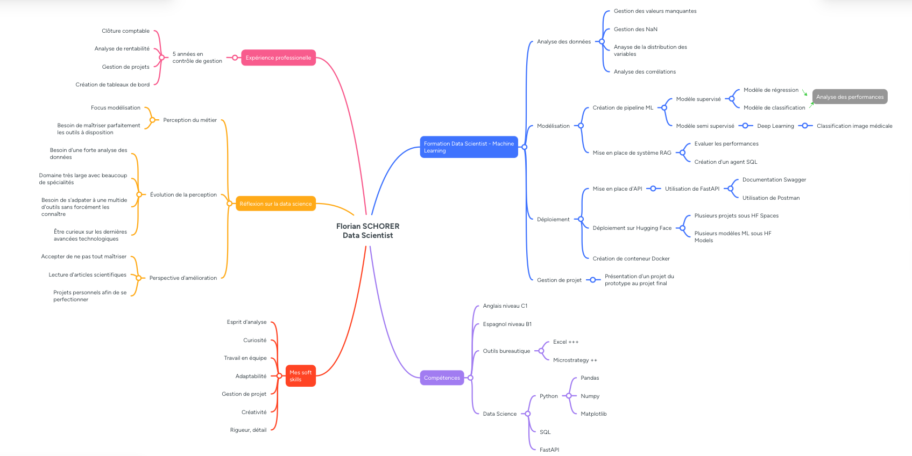

---

  <a href="/" class="btn">🏠 Accueil</a>
  <a href="/systeme_recommandation" class="btn">⚙️ Projet technique</a>
    <a href="/carte_mentale" class="btn">🧠 Carte mentale</a>
  <a href="/formation_projet" class="btn">📁 Projets réalisés</a>
  <a href="/contact" class="btn">📞 Contact</a>

---

## Carte conceptuelle récapitulant mes compétences et mon parcours

On trouvera à l'intérieur de cette carte :

- La valorisation de mes compétences et de mon expérience via les projets de la formation.
- L'illustration de mon niveau pour chaque compétence ou en langues étrangères.
- Identification des axes d’amélioration et les défis restant à affronter.
- Analyse de l’évolution de ma perception du rôle de Data Scientist.
- Mise en valeur des softs skills
- Présentation rapide des expériences passées

