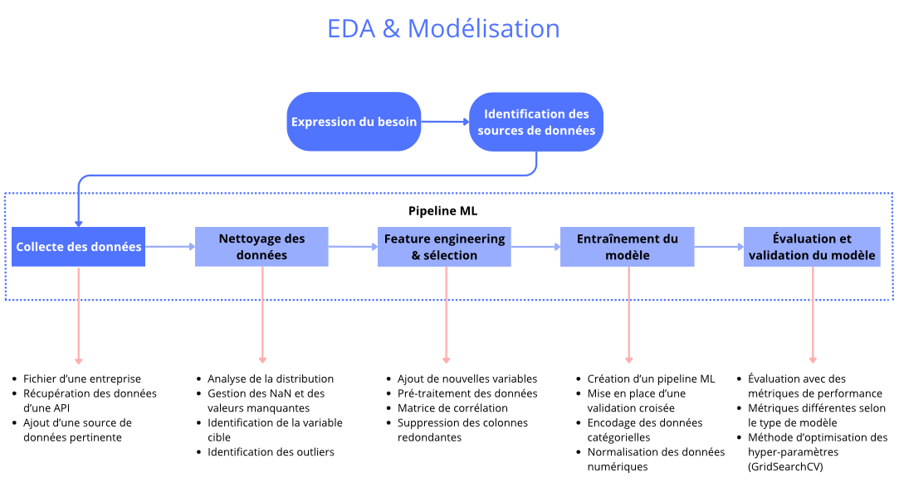

---

  <a href="/" class="btn">🏠 Accueil</a>
  <a href="/systeme_recommandation" class="btn">📄 Projet technique</a>
  <a href="/carte_mentale" class="btn">🧠 Carte conceptuelle</a>
  <a href="/formation_projet" class="btn">📁 Projets réalisés</a>
  <a href="/contact" class="btn">📞 Contact</a>
  <a href="/en/" class="btn" style="background-color: #f0f0f0 !important; color: #606060 !important; font-weight: bold;">🇬🇧 English Version</a>

---
# Schéma EDA & modélisation

# Système de recommandation agricole 

Ce projet a pour but de réaliser une application web simple et intuitive pour aider les agriculteurs à prendre de meilleurs décisions. L'application aura deux fonctions au sein de la même interface :

- Fonction de prédiction : Permettre à un utilisateur de sélectionner une culture spécifique, de renseigner les conditions de sa parcelle (température, usage de pesticides, etc.) et d'obtenir une estimation chiffrée du rendement attendu.
- Fonction de recommandation : L'utilisateur renseigne uniquement les conditions de sa parcelle, et l'application lui recommande la culture la plus rentable en simulant le rendement pour toutes les cultures possibles et en affichant un classement.

  <a href="/assets/pdf/rapport_metier.pdf" class="btn" target="_blank">📄 Rapport métier</a>

---