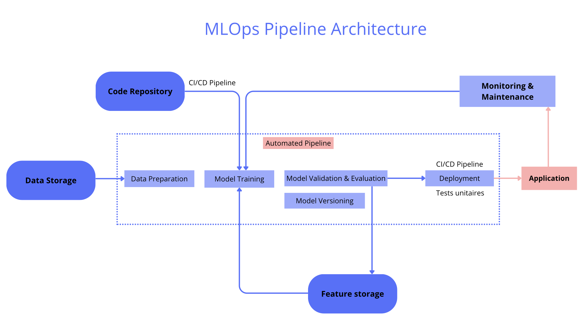

---

  <a href="/" class="btn">🏠 Accueil</a>
  <a href="/systeme_recommandation" class="btn">📄 Projet technique</a>
  <a href="/carte_mentale" class="btn">🧠 Carte conceptuelle</a>
  <a href="/formation_projet" class="btn">📁 Projets réalisés</a>
  <a href="/contact" class="btn">📞 Contact</a>
  <a href="/en/" class="btn" style="background-color: #f0f0f0 !important; color: #606060 !important; font-weight: bold;">🇬🇧 English Version</a>

---
# Schéma MLOps

# Voici les projets réalisés

## Système de recommandation agricole 

Ce projet a pour but de réaliser une application web simple et intuitive pour aider les agriculteurs à prendre de meilleurs décisions. L'application aura deux fonctions au sein de la même interface :

- Fonction de prédiction : Permettre à un utilisateur de sélectionner une culture spécifique, de renseigner les conditions de sa parcelle (température, usage de pesticides, etc.) et d'obtenir une estimation chiffrée du rendement attendu.
- Fonction de recommandation : L'utilisateur renseigne uniquement les conditions de sa parcelle, et l'application lui recommande la culture la plus rentable en simulant le rendement pour toutes les cultures possibles et en affichant un classement.

  <a href="/assets/pdf/rapport_metier.pdf" class="btn" target="_blank">📄 Rapport métier</a>

---

## Déploiement d'un modèle de scoring

Précédemment nous avons réalisé un modèle de scoring en partant du projet Home Credit Default Risk de Kaggle. Nous allons reprendre le meilleur modèle de ce projet afin de le déployer.

Les objectifs sont les suivants :

- un historique des versions
- une API fonctionnelle -> FastAPI avec une interface réalisée avec Gradio
- des tests unintaires automatisés
- un dockerfile
- une analyse du Data Drift -> Réalisée avec EvidentlyAI
- un dashboard avec Streamlit
- une solution de stockage des données en production
- un pipeline CI/CD
- une documentation README

---

## Modèle de scoring avec suivi MLFlow

L'objectif de ce projet est de réaliser un modèle de scoring et un suivi sur MlFlow à partir du projet Home Credit Default Risk sur Kaggle.

La problématique :

- Construire et optimiser un modèle de scoring qui donnera une prédiction sur la probabilité de faillite d'un client de façon automatique.
- Analyser les features qui contribuent le plus au modèle, d’une manière générale (feature importance globale) et au niveau d’un client (feature importance locale), afin, dans un soucis de transparence, de permettre à un chargé d’études de mieux comprendre le score attribué par le modèle.
- Mettre en œuvre une approche globale MLOps de bout en bout, du tracking des expérimentations à la pré-production du modèle.

---