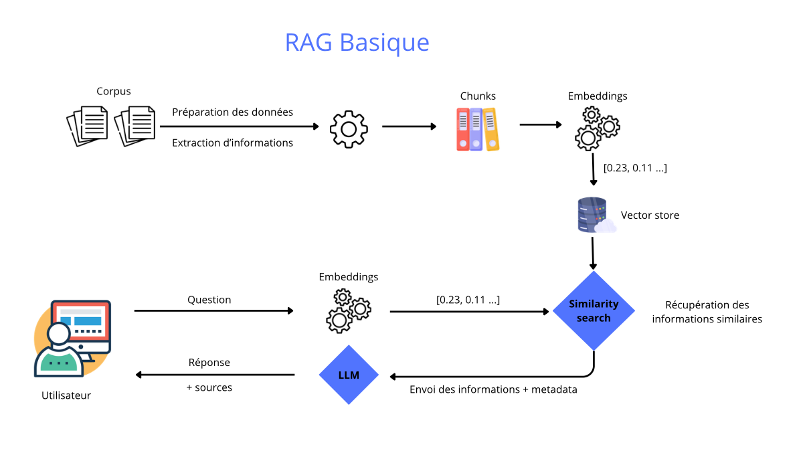
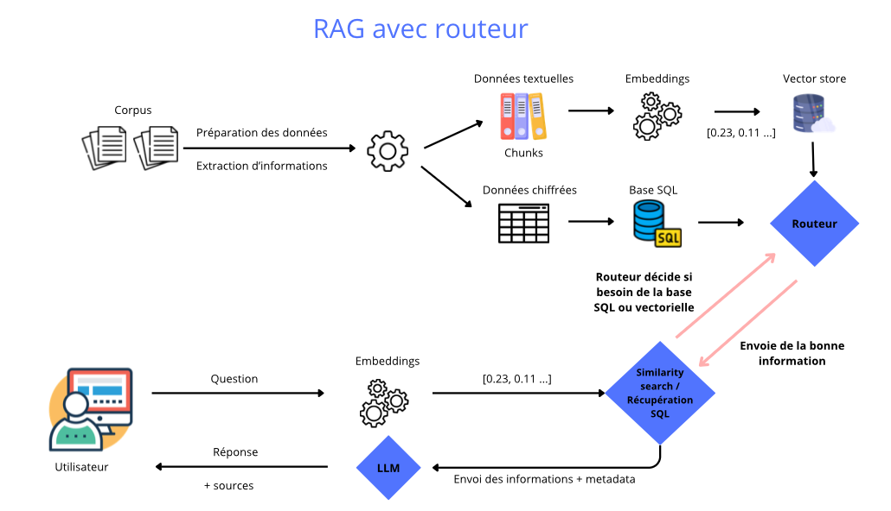

---

  <a href="/" class="btn">🏠 Accueil</a>
  <a href="/systeme_recommandation" class="btn">📄 Projet technique</a>
  <a href="/carte_mentale" class="btn">🧠 Carte conceptuelle</a>
  <a href="/formation_projet" class="btn">📁 Projets réalisés</a>
  <a href="/contact" class="btn">📞 Contact</a>
  <a href="/en/" class="btn" style="background-color: #f0f0f0 !important; color: #606060 !important; font-weight: bold;">🇬🇧 English Version</a>

---
# Schéma RAG basique

# Schéma RAG avec routeur

# Voici les projets réalisés

## Évaluez les performances d'un LLM

Ce projet implémente un assistant virtuel basé sur un modèle Llama, utilisant la technique de Retrieval-Augmented Generation (RAG) pour fournir des réponses précises et contextuelles à partir d'une base de connaissances personnalisée. L'objectif est de reprendre un prototype réalisé qui était fonctionnel et de procéder à des améliorations afin d'obtenir de meilleurs résultats. Les améliorations seront visibles avec une comparaison des métriques Ragas sur le prototype vs la nouvelle structure du projet.

---

## Déploiement d'un système RAG

Ce projet est une Preuve de Concept (POC). Il s'agit d'un chatbot intelligent capable de recommander des événements culturels à Paris (concerts, théâtres, expositions) en se basant sur des données fraîches via l'API OpenAgenda.

Le système utilise une architecture RAG (Retrieval-Augmented Generation) pour garantir que les réponses sont factuelles et basées sur les documents fournis, évitant ainsi les hallucinations des modèles de langage classiques.

---
