---

  <a href="/" class="btn">🏠 Accueil</a>
  <a href="/systeme_recommandation" class="btn">⚙️ Projet technique</a>
  <a href="/carte_mentale" class="btn">🧠 Carte mentale</a>
  <a href="/formation_projet" class="btn">📁 Projets réalisés</a>
  <a href="/contact" class="btn">📞 Contact</a>

---

# Rapport de conduite de projet Data & ML

## Contexte et analyse des besoins

1. [Présentation](#présentation)
2. [Collecte et analyse du besoin métier](#collecte-et-analyse-du-besoin-métier)
3. [Audit de la solution data existante](#audit-de-la-solution-data-existante)
4. [Identification de la solution technique cible](#identification-de-la-solution-technique-cible)
5. [Proposition de démarche projet](#proposition-de-démarche-projet)
6. [Contrôle et suivi du projet](#contrôle-et-suivi-du-projet)
7. [Outils et process de suivi](#outils-et-process-de-suivi)
8. [Évaluation RAGAS du nouveau système](#évaluation-RAGAS-du-nouveau-système)
9. [Limites des métriques RAGAS](#limites-des-métriques-RAGAS)
10. [Conclusion et recommandations](#conclusion-et-recommandations)
11. [Annexes](#annexes)

## Présentation

**SportSee** est une entreprise évoluant dans le secteur de la data sportive, spécialisée dans la production et la valorisation de contenus et de statistiques autour du Basketball. L'entreprise s'adresse à la fois aux amateurs de basketball (contenus éditoriaux, forums) et aux clients professionnels (médias, applications de fantasy sports, parieurs, analystes).

- Secteur d'activité : data sportive — édition de contenu et fourniture de statistiques de Basketball.
- Taille estimée : PME en phase de croissance, avec une équipe produit/data restreinte.
- Enjeux stratégiques liés à la donnée : la donnée est le cœur de métier de SportSee. La valeur produite dépend directement de la capacité à croiser des données structurées (statistiques officielles NBA) avec des données non structurées (articles, forums Reddit, communiqués) pour offrir une expérience utilisateur enrichie et différenciante.

- Maturité data & ML :

    - **Forces** : une base de données statistiques NBA bien structurée, une veille active sur les forums et archives textuelles, et un premier prototype de chatbot déjà réalisé.
    - **Faiblesses** : le prototype existant n'a jamais été évalué objectivement, pas d'observabilité en production, pas de monitoring des coûts d'inférence, absence de validation stricte des entrées/sorties, et pas de processus industrialisé d'intégration des évolutions du modèle.

## Collecte et analyse du besoin métier

### **Identification des parties prenantes**

| Pertie prenante | Rôle | Attentes principales |
| --- | --- | --- |
| Direction SportSee | Commanditaire | ROI mesurable, différenciation produit, maîtrise des coûts |
| Équipe éditoriale | Utilisateurs internes | Assistant pour accélérer la recherche documentaire |
| Data Scientist  | Réalisateur | Projet reproductible, évaluable, monitoré |

### **Recueil justifié des besoins métiers**

La démarche de recueil s'est appuyée sur trois sources complémentaires :

- **Brief initial de SportSee** : l'entreprise a remonté explicitement une insatisfaction sur les réponses du chatbot existant, particulièrement sur les questions statistiques. Les réponses sur les archives textuelles étaient jugées « encourageantes » mais celles portant sur les chiffres étaient jugées insuffisantes.
- **Audit du prototype existant** : prise en main du projet, lancement de l'interface Streamlit, interaction avec le chatbot sur différents types de questions (simples, compliquées, bruitées).
- **Évaluation chiffrée via RAGAS** : mise en place d'un jeu d'évaluation de 20 questions couvrant trois niveaux de complexité et quatre métriques standard du domaine (faithfulness, answer relevancy, context precision, context recall).

### **Hiérarchisation des besoins (matrice de priorisation Valeur × Effort)**

Dix besoins métier ont été identifiés, puis positionnés dans une matrice Valeur métier × Effort de mise en oeuvre :

| Besoin métier | Quadrant | Justification |
| --- | --- | --- |
| Fiabiliser les réponses (réduire les hallucinations) | Projet stratégique | Problème n°1 remonté, nécessite une refonte RAG complète |
| Améliorer les réponses sur questions statistiques | Projet stratégique | Nécessite base SQL + routeur |
| Mise en place d'une base de données SQL | Quick win | Nécessite une database comme PostgreSQL |
| Création d'un environnement structuré | Projet stratégique | Séparation rag de la logique API et interface |
| Maintenir la qualité des réponses textuelles  | À éviter | Déjà fonctionnel, à voir dans les perspectives |
| Gérer les questions mixtes (texte + chiffres)  | Projet stratégique | Routeur, dépend de l'architecture dual-source |
| Évaluer objectivement les performances  | Quick win | Valeur forte pour effort modéré via RAGAS |
| Monitorer le système en production  | Projet stratégique | Mise en place Logfire |
| Garantir la robustesse (pas de crash)  | Projet stratégique | Mise en place Logfire |
| Offrir plusieurs modes d'interaction  | Tâche mineure | Postman + Interface |
| Documenter l'API (Swagger)  | Tâche mineure | Automatique avec FastAPI |
| Maîtriser les coûts d'inférence  | Quick win | Blocage réel rencontré (limite tokens Mistral) |

**Plan d'action déduit** : prioriser les quick wins pour débloquer rapidement la situation, puis engager les projets stratégiques qui nécessitent la refonte architecturale.

## Audit de la solution data existante

Le prototype reçu en entrée de mission présente les caractéristiques suivantes :

### **Outils et technologies**

- Langage : Python
- Interface utilisateur : Streamlit
- LLM : Mistral mistral-small-latest
- Embeddings : Mistral mistral-embed
- Orchestration : LangChain
- Base vectorielle : FAISS
- Gestion des dépendances : requirements.txt

### **Pipeline d'exploitation des données**

1. Chargement des documents PDF (captures d'écran de fils Reddit) et d'un fichier Excel (statistiques NBA par joueur).
2. Découpage en chunks textuels (le fichier Excel est traité comme du texte brut).
3. Création d'embeddings Mistral.
4. Indexation dans FAISS.
5. À la requête utilisateur : recherche sémantique → passage du contexte au LLM → génération de la réponse.

### **Organisation du projet**

Structure monolithique, code regroupé dans quelques fichiers (`MistralChat.py`, `indexer.py`, `utils/vector_store.py`, `utils/data_loader.py`) sans séparation claire des responsabilités, pas de tests, pas de logs, pas d'API.

## Évaluation RAGAS du prototype existant

Quatre critères ont été retenus : performance qualitative (via RAGAS), robustesse, coût et scalabilité, pertinence métier.

### **Résultats de l'évaluation RAGAS sur le prototype**

Évaluation sur 20 questions réparties en trois catégories (faciles, compliquées, bruitées) :

- **Au global** :

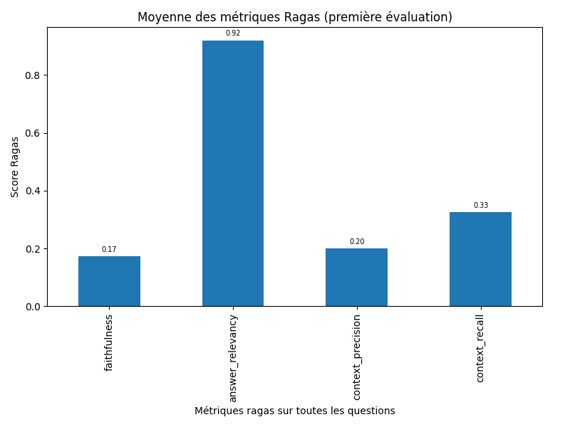

Answer relevancy (0,92) : Le LLM comprend bien la question

Faithfulness (0,17) : Hallucinations massives, les réponses ne s'appuient pas sur le contexte

Context precision (0,20) : Retrieval bruité, beaucoup de documents non pertinents ramenés

Context recall (0,33) : Informations clés souvent absentes du contexte

- **Par catégorie de question** :

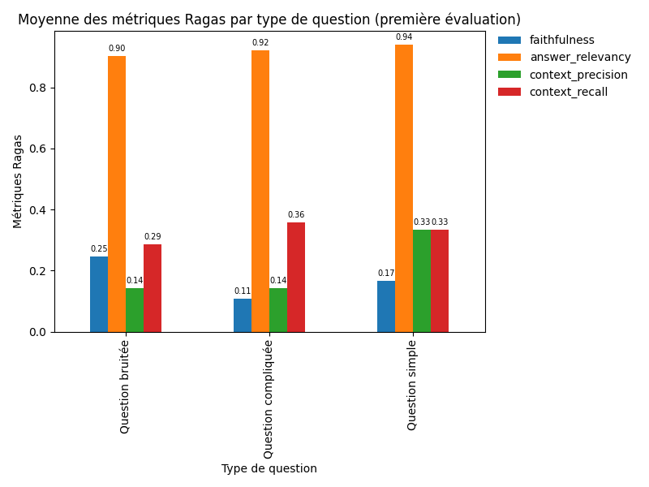

**Constat principal** : le prototype produit des réponses sémantiquement cohérentes avec la question mais factuellement non fiables. Le modèle compense le manque d'information pertinente en extrapolant à partir de ses connaissances internes, ce qui est inacceptable sur un cas d'usage de restitution statistique.

### **Identification des écarts et des limites**

| Écart | Cause racine |
| --- | --- |
| Faithfulness très basse | Les chunks récupérés ne contiennent pas les bonnes informations, le LLM invente |
| Retrieval inefficace sur les stats | Le fichier Excel est traité comme du texte, les données chiffrées sont « perdues » lors du chunking |
| Aucune visibilité en production | Pas de logs, pas de monitoring |
| Pas de garde-fou sur les entrées/sorties | Une entrée vide fait planter l'application |
| Pas d'API | Impossible d'intégrer le chatbot à un système tiers|
| Dépendance monolithique à Mistral | Limite de tokens gratuits atteinte rapidement |

### **Visualisation du système RAG existant**

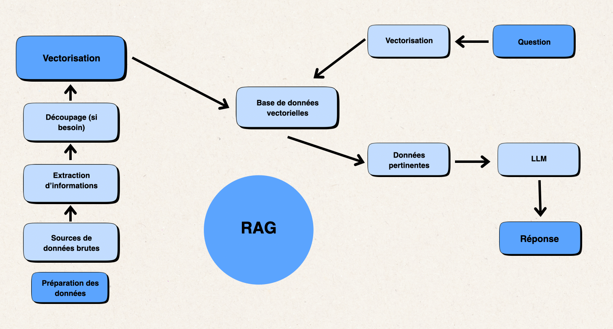

### **Conclusion de l'audit :**

Le prototype est fonctionnel comme démonstrateur mais non-adapté à un usage en production. Il nécessite une refonte architecturale pour traiter correctement les données hétérogènes (texte + chiffres) et intégrer des mécanismes d'évaluation, de monitoring et de robustesse.

## Identification de la solution technique cible

### **Comparatif d'approches techniques**

Trois approches ont été envisagées pour répondre au besoin :

| Approche | Principe | Avantages | Inconvénients |
| --- | --- | --- | --- |
| A. RAG pur amélioré | Garder une seule base vectorielle mais améliorer le chunking, les embeddings et le prompt | Simple à mettre en œuvre, conserve l'architecture prototype | Ne résout pas le problème fondamental : les chiffres restent noyés dans le texte |
| B. Text-to-SQL pur | Remplacer le RAG par un agent qui génère du SQL à partir de la question | Excellente précision sur les stats | Perd toute la valeur des archives textuelles (Reddit) |
| C. RAG hybride avec routeur| Deux bases (vectorielle + SQL), un routeur LLM qui oriente la requête vers la bonne source | Traite chaque type de donnée avec l'outil adapté | Complexité architecturale supérieure, coût d'orchestration |

**Choix retenu** : approche C (RAG hybride avec routeur), seule à répondre à l'ensemble des besoins métier (questions statistiques ET questions textuelles ET questions mixtes).

### **Architecture cible**

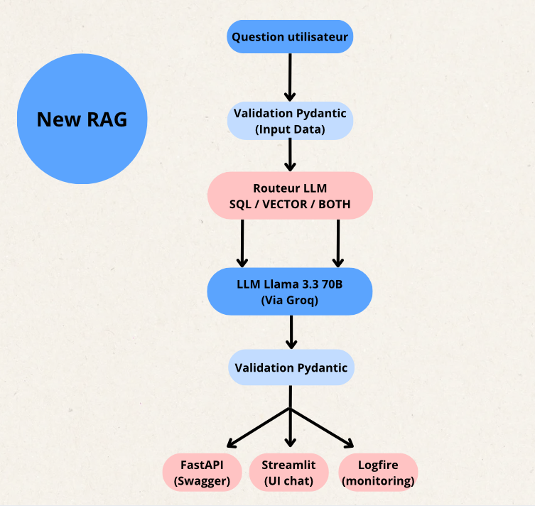

### **Facteurs clés de succès et points de vigilance**

- Un routeur LLM bien prompté qui fait les bons choix d'orientation.
- Une base SQL propre avec des métadonnées (glossaire des acronymes de stats NBA) pour aider le LLM à générer du SQL correct.
- Un jeu d'évaluation RAGAS solide pour valider les améliorations.
- Une observabilité de bout en bout pour détecter les régressions.

### **Points de vigilance**

- Biais LLM-as-a-judge : RAGAS s'appuie sur un LLM pour noter, ce qui introduit un biais de verbosité et une sensibilité au formatage.
- Barrière linguistique : les modèles d'embedding utilisés sont optimisés pour l'anglais, la nuance du français peut être sous-évaluée.
- Dépendance au ground truth : la qualité de l'évaluation est plafonnée par la qualité du jeu de référence.
- Dérive des performances dans le temps : nécessité d'un monitoring continu.

### **Hiérarchisation des cas d'usage**

**Méthodologie** : pour chaque cas d'usage, évaluation selon trois critères :
- fréquence d'usage attendue
- valeur métier
- faisabilité technique

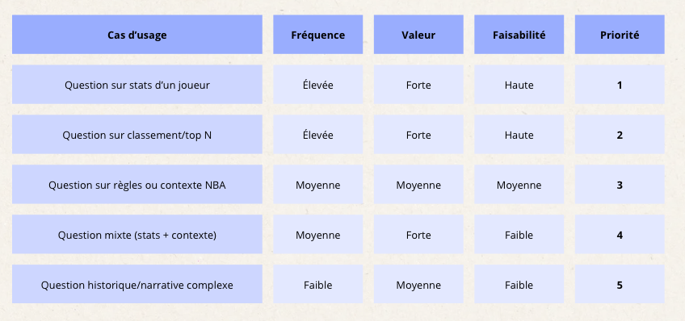

## Proposition de démarche projet

### **Roadmap de mise en œuvre du nouveau prototype - sur la partie ML**

| Phase | Contenu | Livrable | Durée indicative |
| --- | --- | --- | --- |
| Phase 1 — Audit | Prise en main prototype, RAGAS v1, diagnostic | Rapport d'audit chiffré | 1 semaine |
| Phase 2 — Refonte | Nouvelle architecture, migration Groq, base SQL, routeur | Nouveau système fonctionnel | 3 semaines |
| Phase 3 — Fiabilisation | Validation Pydantic, conteneurisation Docker, API FastAPI | Système robuste et déployable | 1 semaine |
| Phase 4 — Observabilité | Intégration Logfire, dashboards, suivi des coûts | Monitoring en place | 1 semaine |
| Phase 5 — Évaluation finale | RAGAS v2, comparaison avant/après, documentation | Rapport de résultats | 1 semaine |

**Total estimé** : 7 semaines.

### **Méthodologie de gestion de projet**

La démarche retenue combine deux approches complémentaires :

- **CRISP-DM** pour la structuration globale du projet data : compréhension métier → compréhension des données → préparation → modélisation → évaluation → déploiement.

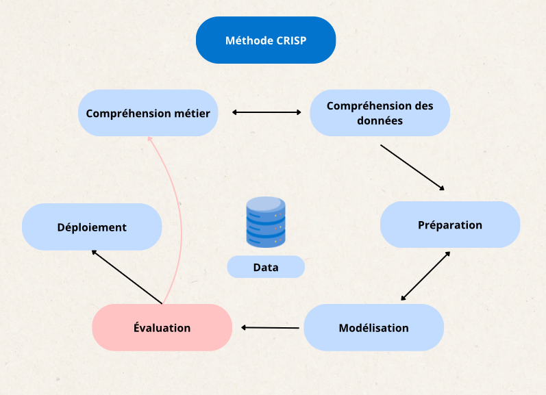

- **Agile** pour les cycles d'amélioration itératifs : sprints courts, démonstrations intermédiaires, ajustement du périmètre selon les résultats d'évaluation RAGAS.

## Aide à la prise de décision

### **Synthèse des risques et opportunités**

| Type | Élément | Impact | Probabilité | Définition |
| --- | --- | --- | --- | --- |
| Risque | Régression de qualité après migration LLM | Élevé | Moyenne | Évaluation RAGAS avant/après, seuil de blocage |
| Risque | Explosion des coûts d'inférence | Moyen | Moyenne | Monitoring des tokens via Logfire, alertes budgétaires |
| Risque | Hallucinations persistantes | Élevé | Faible | Validation Pydantic + jeu de test étendu |
| Risque | Panne du provider LLM (Groq) | Moyen | Faible | Architecture modulaire permettant un changement de modèle |
| Opportunité | Extension à d'autres sports | — | — | Architecture réutilisable |
| Opportunité | Vente de l'API à des tiers | — | — | Documentation Swagger déjà en place |

### **Scénarios budgétaires sur la partie ML**

Trois scénarios d'implémentation ont été étudiés, couvrant l'essentiel des coûts sur la première année d'exploitation :

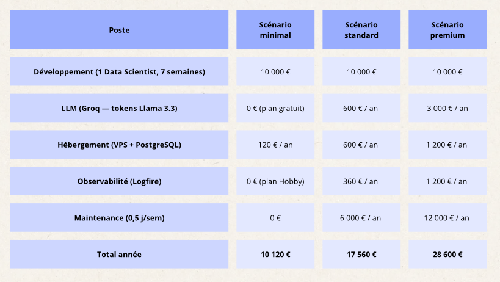

- **Scénario minimal** (≈ 10 120 €) : adapté à une phase de démonstration interne ou de preuve de concept. Le système fonctionne en plan gratuit chez Groq et Logfire, l'hébergement se limite à un petit VPS, et aucune maintenance n'est externalisée. Cette option permet de valider la valeur métier avant d'investir davantage, mais expose à des plafonds de tokens et à une absence de support en cas d'incident.
- **Scénario standard** (≈ 17 560 €) : recommandé pour un passage en production mesuré. Les forfaits payants chez Groq et Logfire garantissent un volume de requêtes confortable et un monitoring complet. Une demi-journée de maintenance hebdomadaire permet de traiter les incidents, d'itérer sur les évaluations RAGAS et d'ajuster les prompts. C'est le meilleur compromis entre coût et qualité de service pour une première mise en production.
- **Scénario premium** (≈ 28 600 €) : dimensionné pour un usage grand public à forte volumétrie. L'infrastructure cloud renforcée, les quotas LLM étendus et une journée de maintenance hebdomadaire garantissent une disponibilité élevée et une réactivité sur les évolutions. Ce scénario est pertinent si le chatbot devient un produit commercialisé ou intégré à l'application principale de SportSee.
- **La maintenance** va permettre principalement 4 choses :
    - Surveillance des performances et détection de dérive
    - Gestion des incidents et support
    - Enrichissement du jeu d'évaluation
    - Ajustement des prompts et du routeur

*Les montants sont des ordres de grandeur.*

### **Indicateurs de succès**

**KPIs techniques** :

- Faithfulness ≥ 0,80 (vs 0,17 sur prototype)
- Context precision ≥ 0,70 (vs 0,20 sur prototype)
- Context recall ≥ 0,70 (vs 0,33 sur prototype)
- Temps de réponse médian < 5 s
- Taux d'erreur de validation Pydantic < 1 %

**KPIs business** :

- Taux d'adoption du chatbot (nombre de questions/jour)
- Taux de questions sans réponse satisfaisante (retour utilisateur)
- Coût moyen par question (€ / requête)
- Disponibilité de l'API (uptime ≥ 99 %)

### **Impacts potentiels pris en compte**

| Dimension | Analyse |
| --- | --- |
| Éthique | Un chatbot sportif a un impact éthique limité. Attention néanmoins aux biais issus des archives Reddit (commentaires subjectifs de fans) à signaler comme tels dans les réponses. |
| Légal / réglementaire | Pas de données personnelles (RGPD sans objet direct). Attention à la propriété intellectuelle : les données NBA sont publiques mais leur agrégation commerciale peut faire l'objet de licences. |
| Business | Risque de désintermédiation (si le chatbot répond, l'utilisateur ne lit pas les articles éditoriaux) à arbitrer avec la direction. |
| Organisationnel | Nécessite une montée en compétence de l'équipe dev sur l'usage de l'API et l'interprétation des logs Logfire. |
| Environnemental | L'inférence LLM consomme de l'énergie : privilégier le cache des réponses fréquentes et limiter les appels inutiles via la validation amont. |

---

## Contrôle et suivi du projet

### **Indicateurs de suivi**

Le tableau de bord Logfire centralise cinq familles d'indicateurs :

| Famille | Indicateurs | Source | Fréquence |
| --- | --- | --- | --- |
| Performance ML | Faithfulness, Answer relevancy, Context precision, Context recall | RAGAS + Logfire | À chaque évaluation |
| Qualité des données | Taux de validation Pydantic (entrée/chunks/sortie), nombre d'erreurs détectées | Logfire (via spans) | Temps réel |
| Performance technique | Temps de réponse par question, consommation CPU, consommation mémoire | Logfire system metrics | Temps réel |
| Coûts | Nombre de tokens consommés, coût estimé par requête, coût mensuel | Dashboard Logfire custom | Quotidien |
| Usage / livrables | Répartition des routes choisies (SQL / VECTOR / BOTH), nombre de requêtes/jour | Logfire (spans router) | Hebdomadaire |

### **Mode et fréquence de reporting**

- **Reporting interne (équipe projet)** : point hebdomadaire sur les dashboards Logfire.
- **Reporting commanditaire (SportSee)** : bilan mensuel sur un tableau de synthèse avec les KPIs business.
- **Reporting d'évaluation** : à chaque évolution majeure du modèle, exécution du pipeline RAGAS et comparaison avec la version précédente (historique stocké dans Logfire).

## Outils et process de suivi

### **Méthodes de suivi des expérimentations ML**

- **Versionning du code** : Git + GitHub, avec branches `develop` et feature branches.
- **Versionning des données d'évaluation** : fichiers CSV stockés dans `data/processed/` (`first_ragas_results.csv`, `second_ragas_results.csv`, `concat_eval_ragas.csv`).
- **Traçabilité des expérimentations** : chaque évaluation RAGAS génère un span Logfire horodaté, ce qui permet de rejouer l'historique des scores.
- **Reproductibilité** : environnement Poetry + Dockerfile pour garantir l'identité des dépendances entre environnements.

### **Outils de gestion projet et collaboration**

| Usage | Outil |
| --- | --- |
| Versionning | Git / GitHub |
| Gestion des dépendances | Poetry |
| Conteneurisation | Docker |
| API & documentation | FastAPI + Swagger |
| Interface de test | Streamlit + Postman |
| Observabilité & monitoring | Pydantic Logfire |
| Évaluation ML | RAGAS |
| LLM provider | Groq |
| Base vectorielle | FAISS |
| Base relationnelle | PostgreSQL |

---

## Évaluation RAGAS du nouveau système - premiers résultats

Le nouveau système a été évalué sur les mêmes 20 questions que le prototype, afin de garantir une comparaison rigoureuse.

- **Au global** :

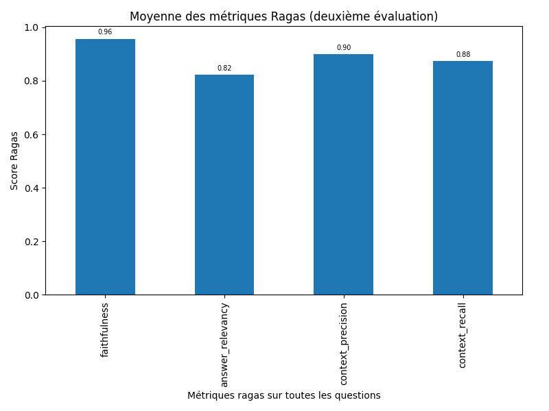

Sur l'ensemble des 4 métriques, les résultats sont solides et démontrent des réponses cohérentes et documentées sur les 20 questions posées.

- **Par catégorie de question** :

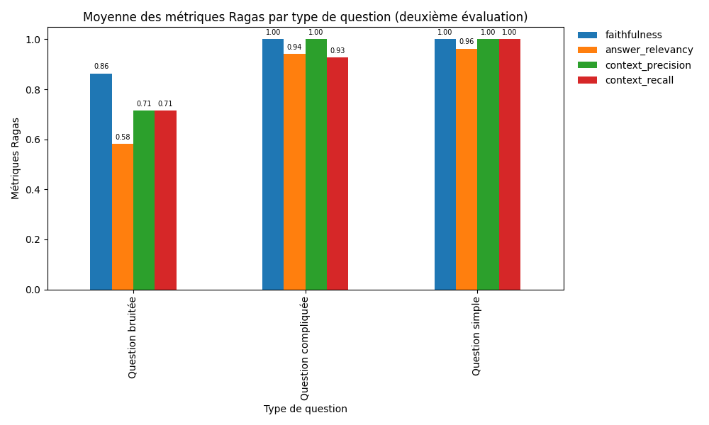

On observe une logique attendue :

- Les meilleurs scores sont obtenus sur les questions simples.
- Une légère diminution apparaît sur les questions compliquées.
- Une baisse plus prononcée est visible sur les questions bruitées.

Ce comportement confirme que le système traite correctement les cas nominaux et qu'un axe d'amélioration reste la robustesse face aux questions volontairement bruitées.

### **Comparaison avant / après**

La comparaison entre le prototype et le nouveau système, sur la moyenne des 20 questions :

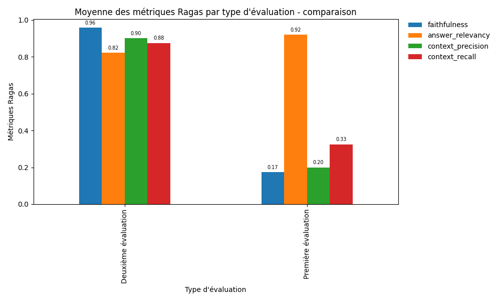

Les résultats démontrent une **amélioration significative du modèle** :

| Métrique | Prototype | Nouveau système | Évolution |
| --- | --- | --- | --- |
| Faithfulness | 0,17 | 0,96 | Forte hausse |
| Context precision | 0,20 | 0,90 | Forte hausse |
| Context recall | 0,33 | 0,88 | Forte hausse |
| Answer relevancy | 0,92 | 0,82 | Légère baisse |

**Lecture des résultats** :

- Sur **faithfulness, context_recall et context_precision**, les métriques progressent fortement et prouvent :
    - une meilleure qualité de récupération des documents,
    - des documents récupérés effectivement utiles,
    - des affirmations des réponses qui s'appuient sur des faits du contexte.
- Sur **answer_relevancy**, le score a légèrement baissé mais reste supérieur à 0,80 :
    - le score élevé du prototype était en partie artificiel : le système allait chercher des informations sur internet, produisait des réponses sémantiquement proches de la question mais factuellement fausses,
    - sur le nouveau système, la réponse s'appuie uniquement sur les documents récupérés et répond de manière plus pertinente à la question.

### **Focus sur les questions mixtes**

Les questions qui nécessitent une récupération à la fois dans les PDF et dans la base de données (« BOTH ») constituent le cas d'usage le plus exigeant :

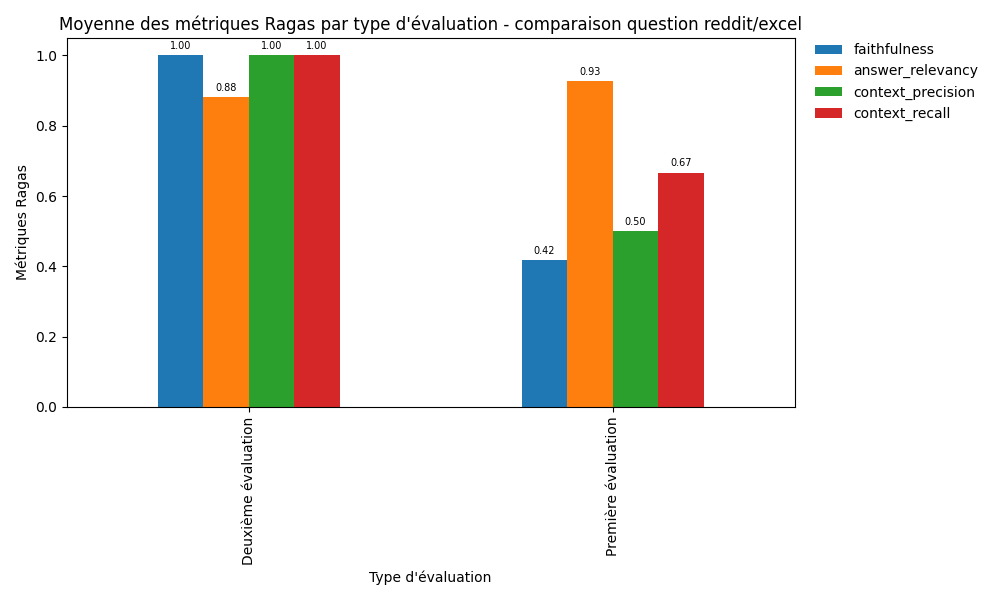

- Le système est désormais capable de récupérer les deux contextes simultanément (base SQL + base vectorielle).
- Des améliorations sont visibles sur l'ensemble des métriques entre la première et la deuxième méthode.
- Des axes de progression subsistent pour pousser le système encore plus loin sur ce type de questions.

## Limites des métriques RAGAS

Bien que RAGAS soit un standard pour évaluer les systèmes RAG, plusieurs limites et biais ont été identifiés et doivent être pris en compte dans l'interprétation des résultats.

### **Biais du LLM-as-a-Judge**

L'évaluation RAGAS repose sur un LLM externe pour noter les réponses. Ce paradigme présente des biais connus :

- **Biais de verbosité** : les LLMs ont tendance à attribuer de meilleurs scores aux réponses longues et détaillées, même si une réponse courte était tout aussi correcte.
- **Sensibilité au formatage** : le LLM juge peut être influencé par une mise en forme soignée (listes à puces, ton assuré) et rater une erreur factuelle subtile.

### **Barrière linguistique**

La majorité des LLMs et des modèles d'embedding (comme `all-MiniLM-L6-v2` utilisé ici) sont optimisés pour l'anglais. L'évaluation de concepts complexes ou de nuances en français peut parfois être légèrement biaisée ou mal comprise par le modèle juge lors du calcul de la pertinence (*Answer Relevancy*) ou de la précision du contexte.

### **Dépendance au Ground Truth**

Les métriques comme le *Context Recall* dépendent entièrement de la qualité du dataset de test (`ground_truths`). Si une réponse de référence est incomplète ou mal formulée, RAGAS pénalise le système RAG même s'il a fourni une réponse exacte et documentée. L'évaluation est donc plafonnée par la qualité du jeu de test.

### **Opacité stochastique (faux positifs)**

Un score de 1,0 en *Faithfulness* ne garantit pas à 100 % l'absence d'hallucination. Le modèle juge peut lui-même halluciner pendant son processus d'évaluation.

---

## Conclusion et recommandations

1. [Récapitulatif des décisions prises](#récapitulatif-des-décisions-prises)
2. [Perspectives d'évolution](#perspectives-dévolution)
3. [Prochaines étapes recommandées](#prochaines-étapes-recommandées)

### **Récapitulatif des décisions prises**

1. **Refonte architecturale complète** du prototype en système hybride à deux sources (SQL + vectoriel), orchestré par un routeur LLM.
2. **Migration technologique** : passage de Mistral à Llama 3.3 via Groq pour la génération, et aux embeddings HuggingFace `all-MiniLM-L6-v2` pour le vectoriel, afin de s'affranchir des limites de tokens et de maîtriser les coûts.
3. **Mise en place d'une évaluation objective** via RAGAS, avec comparaison avant/après documentée.
4. **Industrialisation** : API FastAPI, conteneurisation Docker, validation Pydantic triple, monitoring Logfire.
5. **Amélioration mesurée** : progression significative sur trois des quatre métriques RAGAS (faithfulness, context precision, context recall) tout en conservant un answer relevancy > 0,80.

### **Perspectives d'évolution**

- **Enrichissement du jeu d'évaluation** : ajouter des questions plus bruitées et adversariales pour stress-tester le système.
- **Élargissement du corpus** : intégrer des données plus riches (résultats détaillés des matchs, composition d'équipes, blessures) et améliorer le prétraitement des PDFs Reddit.
- **Cache sémantique** : mettre en place une couche de cache pour les questions fréquentes (réduction des coûts d'inférence).
- **Feedback utilisateur** : intégrer un mécanisme de thumbs up/down en interface pour enrichir le jeu d'évaluation avec des cas réels.
- **Multilinguisme** : explorer des embeddings multilingues ou spécialisés français pour réduire le biais linguistique.
- **Déploiement cloud** : passer d'un hébergement local à une solution cloud (AWS, GCP, Azure) pour la scalabilité.

### **Prochaines étapes recommandées**

- **Court terme (1 mois)** : mise en production du système sur un environnement de pré-prod, collecte de feedback utilisateur réel.
- **Moyen terme (3 mois)** : enrichissement du corpus, implémentation du cache sémantique, premier bilan mensuel de KPIs business avec SportSee.
- **Long terme (6-12 mois)** : arbitrage sur l'extension à d'autres sports, évaluation de l'opportunité de commercialiser l'API auprès de tiers, revue d'architecture pour le passage à l'échelle.

---

## Annexes

- **Dépôt GitHub du projet** : [https://github.com/SCFlorian/Evaluation_LLM](https://github.com/SCFlorian/Evaluation_LLM)
- **Documentation technique** : fichier `README.md` du dépôt (audit, architecture, évaluations, monitoring).
- **Documentation API** : `http://localhost:7860/docs` (Swagger auto-générée par FastAPI).
- **Jeux de données d'évaluation** : `data/processed/` (CSV des deux évaluations RAGAS).
- **Dashboards Logfire** : accessibles sur `https://logfire.pydantic.dev`.
